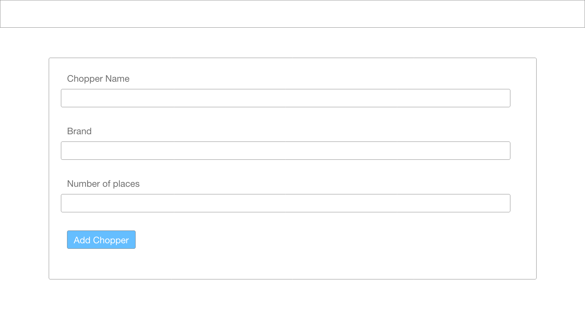
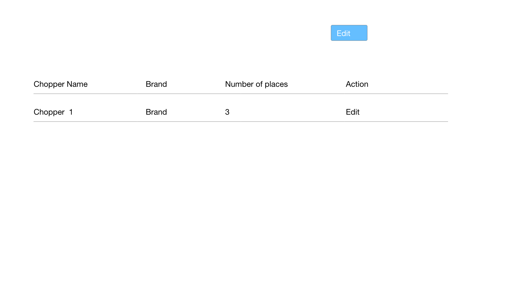

# Supercopter
M1 ICE project  
School year 2018 - 2019

Chopper renting simulator

## Team
Denis Guiraudet, Matthieu Orriere, Arnaud Sibade and last but not least Alexandre Pausé

## Mock-up

### Create a Chopper

### Listing existing Choppers

## Project description

### Slack
Join us on [Slack](https://courscollab2018.slack.com/)  
Channel : team_supercopter

### Specs
The project specs are specified just here in this Readme

### Following
We chose to manage the tasks and issues with [GitHub Project](https://github.com/DenisGuiraudet/ICE_supercopter/projects/1)  
PR management made with a link to issues

### Repository
- [GibHub](https://github.com/DenisGuiraudet/supercopter.git)

### IC
- [Travis](https://travis-ci.com/DenisGuiraudet/supercopter)
> Previous knowledge of this techno by some group members

### Deployment
No hosting for now

### Dev Environment
- Docker

### Techno
- Angular.io
> Knowledge of Angular by some group members and want to improve our skill
- SASS
> Greatly reduces complexity of targeting css
- Bootstrap
> Simpler front development with already existing components
- mongoDB
> MongoDB is a simple database adapte to link with Angular

### Code Style
- TS lint
> We chose to use TS lint cause is the most used linter for TypeScript

### Tests 
- Karma
> Unit testing
- Cypress
> Stimute a real user

## How to run

**Download [Node](https://nodejs.org/en/)**  
Execute `npm install`

**Download [Docker](https://www.docker.com/get-started)**  
To build docker execute `docker build -t supercopter .`  
Then run `docker run -p 80:80 --name supercopter -d supercopter`

Go to `http://localhost:80/`

To stop execute `docker stop supercopter`, then execute `docker rm supercopter`.

### MongoDB server
**Download [MongoDB](https://www.mongodb.com/download-center/community)**  
**Download [nodemon](https://nodemon.io/)**  
Go to 'api' directory.  
Run `nodemon server`. This will auto regenerate the api.

### Running unit tests
Run `ng test` to execute the unit tests via [Karma](https://karma-runner.github.io).

### Running end-to-end tests
Run `ng e2e` to execute the end-to-end tests via [Protractor](http://www.protractortest.org/).

### Code scaffolding
Run `ng generate component component-name` to generate a new component.  
You can also use `ng generate directive|pipe|service|class|guard|interface|enum|module`.

### Build
Run `ng build` to build the project. The build artifacts will be stored in the `dist/` directory. Use the `--prod` flag for a production build.

### Further help
To get more help on the Angular CLI use `ng help` or go check out the [Angular CLI README](https://github.com/angular/angular-cli/blob/master/README.md).

## Dev Tracking

### User story
Go to GitHub, we use Issues as User stories.  
In the `Projects` tab, go to `Issues`, don't forget to move your Issue as you process it.

### Pull Request
Make a new PR (Pull Request) and link it to the associated Issue.
In the `Projects` tab, go to `PR`, don't forget to move your PR as you process it.
